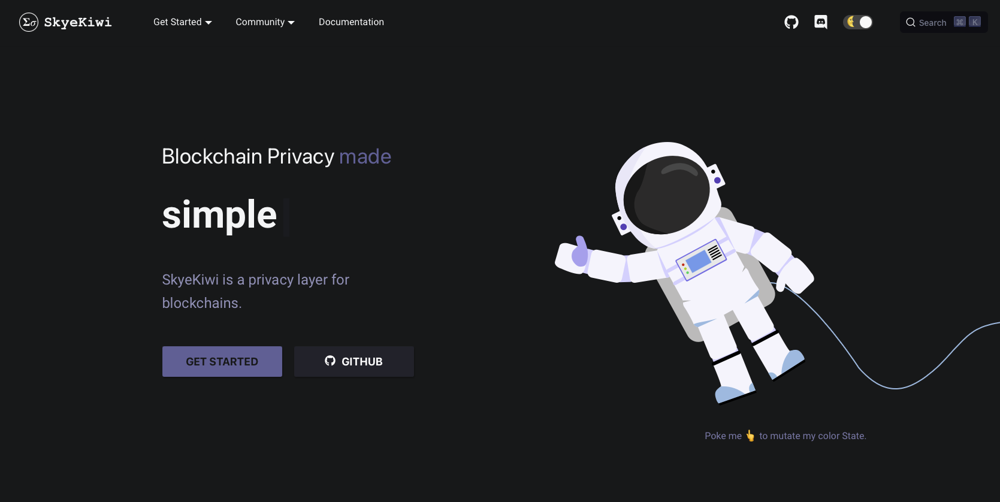

# SkyeKiwi Documentation

<div align="center">
  <a href="https://docs.skye.kiwi">
    
  </a>
</div>

[This website](https://docs.skye.kiwi) is built upon [AgileTS](https://agile-ts.org) using
[Docusaurus 2](https://v2.docusaurus.io/). Pages & components are written in TypeScript, the styles in vanilla CSS with
variables using
[CSS Modules](https://github.com/css-modules/css-modules).
(We would have preferred using [styled-components](https://styled-components.com/) but docusaurus has no ssr support for
it yet)


## Deployment
Our documentation website is proudly deployed on [Railway App](https://railway.app). Along with our internal automation toolchains, our discord and telegram bots. As Web3 developers ourselves, we still deploy some internal lightweight tools onto Web2 infrastractures, and Railway is so far the best. Give it a try :) You will like it too.

[](https://railway.app)


## Installation

```console
yarn install
```

## Local Development

```console
yarn start
```

This command starts a local development server and open up a browser window. Most changes are reflected live without having to restart the server.

## Build

```console
yarn build
```

This command generates static content into the `build` directory and can be served using any static contents hosting service.

